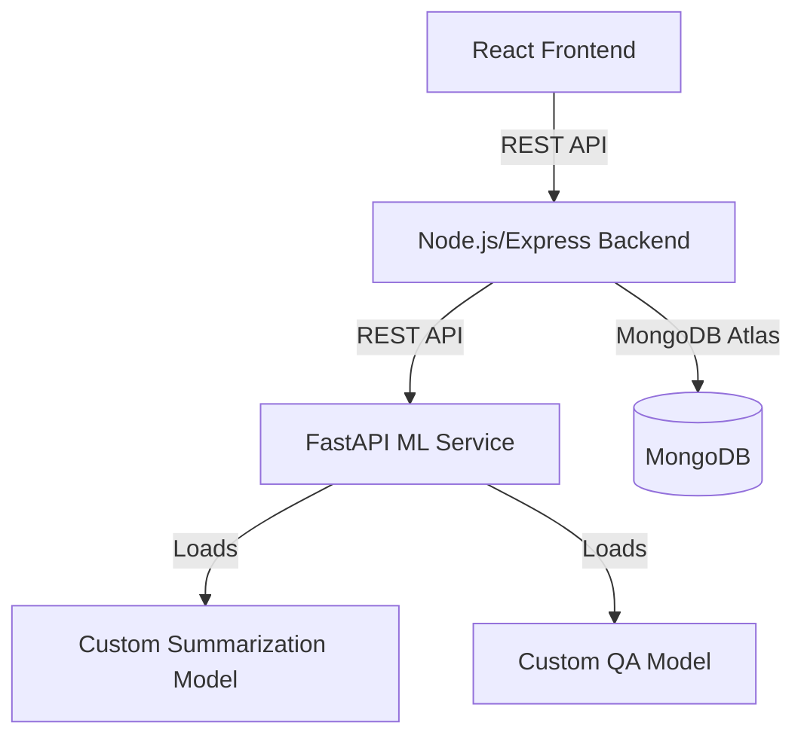

# TextSummarizer (TALQS AI)

TextSummarizer (TALQS AI) is a GenAI-powered, full-stack web application that leverages advanced Transformer-based Deep Learning models to simplify complex legal texts. Designed to make legal information more accessible to lawyers, researchers, and the general public, it summarizes lengthy judgments and answers legal queries through an intuitive interface. Users can upload documents or input text to receive high-quality summaries and interact with a legal Q&A chatbot. The platform features JWT authentication, user profiles, upload and summarization, multi-turn Q&A, and history tracking, and is built with React, Node.js/Express, MongoDB Atlas, and Python FastAPI for custom models.

## ✨ Features

- **User Authentication** (JWT, protected routes)
- **Profile Management**
- **Document/Text Upload & Summarization**
- **Legal Q&A Chatbot** (multi-turn, persistent chat)
- **History of Summaries & Q&A**
- **Modern Responsive UI** (React, Tailwind)
- **Custom ML Models** (PyTorch, HuggingFace, FastAPI)

## 🏗️ Architecture



## 🛠️ Tech Stack

- **Frontend:** React, Tailwind CSS
- **Backend:** Node.js, Express, JWT, Axios
- **Database:** MongoDB Atlas (Mongoose ODM)
- **ML Models:** Python, FastAPI, PyTorch, HuggingFace Transformers

## ⚙️ Setup Instructions

### 1. Clone the Repository

```bash
git clone <your-repo-url>
cd talqs ai
```

### 2. Environment Variables

Create `.env` files in both `backend/` and `models/`:

#### backend/.env

```
PORT=9000
MONGO_URI=your_mongodb_atlas_uri
JWT_SECRET=your_jwt_secret
FASTAPI_URL=http://localhost:8000
```

#### models/.env

```
SUMMARY_MODEL_PATH=summary custom model.pth
QA_MODEL_PATH=qa custom model.pth
```

### 3. Install Dependencies

- **Backend:**
  ```bash
  cd backend
  npm install
  ```
- **Frontend:**
  ```bash
  cd ../frontend
  npm install
  ```
- **Models (FastAPI):**
  ```bash
  cd ../models
  pip install -r requirements.txt
  # or install: fastapi uvicorn torch transformers python-multipart
  ```

### 4. Run the Application

- **Start FastAPI ML Service:**
  ```bash
  cd models
  uvicorn app:app --reload --host 0.0.0.0 --port 8000
  ```
- **Start Backend:**
  ```bash
  cd backend
  npm start
  ```
- **Start Frontend:**
  ```bash
  cd frontend
  npm start
  ```

## 🔑 Authentication

- JWT-based authentication
- Store token in localStorage
- Send `Authorization: Bearer <token>` in API requests

## 📚 API Endpoints

### Backend (Node.js/Express)

- `POST /api/auth/signup` — Register new user
- `POST /api/auth/login` — Login, returns JWT
- `GET /api/profile` — Get user profile (auth)
- `POST /api/upload` — Upload file or text for summarization (auth)
- `POST /api/qa` — Ask a question to the QA bot (auth)
- `GET /api/history` — Get user history (auth)

### FastAPI (Python ML Service)

- `POST /summarize` — Summarize uploaded file/text
  - Request: `{ file: <file> }`
  - Response: `{ summary: <string> }`
- `POST /qa` — Answer legal question
  - Request: `{ question: <string> }`
  - Response: `{ answer: <string> }`

## 🧑‍💻 Usage

1. **Sign up / Login**
2. **Upload a document** or **paste text** to summarize
3. **Download** or **copy** the summary
4. **Ask legal questions** in the floating Q&A chat
5. **View history** of summaries and Q&A
